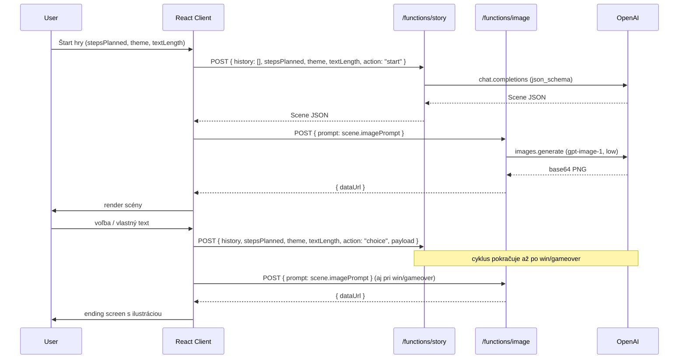

## Tech stack a štart

- **Vite + React (JS)** ako klient, deploy na **Netlify**.
- **Netlify Functions** (Node 20) ako jediný komunikačný bod s OpenAI; `OPENAI_API_KEY` výhradne server-side.
- **`openai` SDK** v functions; klient používa `fetch` na `/.netlify/functions/*`.
- Modely: `gpt-4o-mini` (rýchla story logika, structured output cez `response_format: json_schema`), `gpt-image-1` s `quality: "low"` pre ilustrácie (brainstorm zmieňuje "GPT-image-2" — používame aktuálny `gpt-image-1`, low quality = rýchle a lacné).
- Bez routera (MVP) — view switching cez stav `screen` v root komponente.
- Stav hry **iba v pamäti** (reload = nová hra), žiadny localStorage.

## Štruktúra projektu (module-first, kebab-case)

```
/netlify/functions/
  story.js              # POST: krok hry -> JSON podľa schémy
  image.js              # POST: { prompt } -> { dataUrl } (base64 PNG)
/src/
  main.jsx
  app.jsx               # screen switcher: menu | game | win | gameover
  modules/
    menu/
      menu.jsx          # intro + voľba témy, dĺžky textov a dĺžky hry
    game/
      game.jsx          # scéna: obrázok, popis, voľby, free-text input
      game.service.js   # fetch wrappers pre /story a /image
      game.state.js     # useReducer + helper na build LLM messages
      game.types.js     # JSDoc typedefy pre Scene, GameState, Choice
      components/
        scene-image.jsx
        scene-choices.jsx
        scene-input.jsx
        loading-indicator.jsx
    endings/
      win-screen.jsx
      game-over-screen.jsx
  shared/
    api-client.js       # tenká fetch obálka, error handling
    formatted-text.jsx  # render Markdown subset (**bold**, *italic*, odseky)
  styles/
    base.css            # minimal, čistá typografia (dizajn neskôr)
netlify.toml            # functions dir, redirects, node version
.env.example            # OPENAI_API_KEY=
package.json
README.md
```

## Štruktúrovaný výstup LLM

JSON schema poslaná v `response_format` (Netlify Function ju validuje pred odoslaním klientovi):

```json
{
  "status": "ongoing | win | gameover | rejected",
  "sceneTitle": "string",
  "sceneNarrative": "string",         // popis scény; Markdown: odseky (\\n\\n), **bold**, *italic*
  "imagePrompt": "string",            // krátky vizuálny prompt pre gpt-image-1
  "choices": [                        // 2-3 položky; prázdne pole pri win/gameover/rejected
    { "id": "a", "label": "string" }
  ],
  "rejectionReason": "string|null",   // vyplnené iba pri status=rejected
  "stepNumber": "number",             // 1-based, ktorý krok práve LLM dohral
  "stepsPlanned": "number"            // koľko stepov bolo na začiatku zvolených
}
```

- `rejected` → klient nezvyšuje step, znova zobrazí predchádzajúcu scénu + hlášku z `rejectionReason`.
- `win` / `gameover` → prepne na príslušnú obrazovku, `choices` ignorované.
- `ongoing` v poslednom kroku → systémový prompt núti LLM smerovať k uzavretiu (viď nižšie).

## System prompt (skrátene)

- Vystupuje ako narrator gamebook hry, druhá osoba, atmosférický štýl.
- Dostane `theme` (predpripravená alebo vlastná téma z menu), `textLength` (`concise` | `standard` | `detailed`) a herné parametre `stepsPlanned` / `stepNumber`.
- Dĺžka textov: stručné (2–4 vety), štandardné (1–2 odseky), rozpísané (2–3 odseky); platí pre `sceneNarrative` aj štýl `choices`.
- `sceneNarrative` a `choices.label` používajú jednoduchý Markdown: odseky oddelené prázdnym riadkom, **tučné** pre dôležité detaily, *kurzíva* pre myšlienky a atmosféru. Klient renderuje cez `formatted-text.jsx`.
- Má **prirodzene gradovať** k záveru tak, aby do `stepsPlanned ± 1` mohol vrátiť `win` alebo `gameover`. Nesmie ukončovať násilne.
- Zlé voľby hráča môžu viesť ku `gameover` skôr; nezmyselné odpovede (gibberish, mimo kontext) → `status: "rejected"` s vysvetlením.
- `imagePrompt` má byť 1-2 vety, vizuálny štýl konzistentný s zvolenou témou.

## Tok dát



## Komponenty hlavných obrazoviek

- **`menu.jsx`** — názov hry, výber témy ako klikateľné karty (5 predvolieb + vlastná téma), dĺžka textov ako segment/pill toggle, dĺžka hry ako range slider (5 / 10 / 15 krokov), "Otvoriť príbeh" → `app.jsx` spustí `startGame` z click handlera (nie `useEffect` — vyhne sa dvojitému volaniu v React Strict Mode).
- **`app.jsx`** — pri štarte volá `startGame`, zobrazí loading, potom mountne `Game` s `initialState` alebo rovno ending screen.
- **`game.jsx`** — riadi `useReducer` stav od `initialState`; na desktope (≥900px) **split layout**: sticky obrázok vľavo, scrollovateľný obsah vpravo s progress barom v hlavičke. Na mobile stĺpcový layout. Po každej akcii: čaká na story aj image; UI ukazuje animovaný skeleton pre obrázok kým sa nahráva.
- **`win-screen.jsx` / `game-over-screen.jsx`** — ilustrácia z `imagePrompt` poslednej scény (`SceneImage`), záverečný text + "Play again" → reset do menu.

## Netlify Functions — kľúčové body

- `story.js`: validuje vstup, posiela `messages` (system + skrátená history + user action), `response_format: { type: "json_schema", json_schema: {...} }`, vracia `scene`.
- `image.js`: volá `openai.images.generate({ model: "gpt-image-1", size: "1024x1024", quality: "low" })`, vracia `{ dataUrl: "data:image/png;base64,..." }`.
- Spoločná `_openai-client.js` helper (mimo `functions/` ak nemá byť deploynutá ako endpoint — alebo prefix `_`).
- CORS netreba (same origin via Netlify), ale ošetriť metódu a JSON parse errors.

## `netlify.toml`

```toml
[build]
  command = "npm run build"
  publish = "dist"
  functions = "netlify/functions"

[functions]
  node_bundler = "esbuild"

[[redirects]]
  from = "/api/*"
  to = "/.netlify/functions/:splat"
  status = 200
```

## Dizajn

- **Téma:** "Ancient Codex" — tmavé pozadie s fialovým podtónom, zlaté/jantárové akcenty, serif typografia.
- **Fonty:** `Cinzel` (display/nadpisy, Google Fonts), `Crimson Pro` (narativný text, Google Fonts).
- **Farby:** `--bg: #09080e`, `--gold: #c9a84c`, `--text: #ece4d6` — definované ako CSS custom properties.
- **Desktop layout hry:** flex row split — sticky obrázok 46% vľavo, scrollovateľný obsah vpravo; breakpoint 900px.
- **Animácie:** fade-in scény, staggered vstup volieb (75ms delay per item), pulse loading dots, hover efekty na choices (gold left border).
- **Menu:** theme karty v mriežke, segment-pill pre dĺžku textov, range slider pre počet krokov.
- **Endings:** obrázok s gradient fade do obsahu, badge (Víťazstvo / Koniec hry).

## Mimo rozsahu MVP

- Hudba, perzistencia hry, multi-jazyčnosť, autentifikácia, leaderboardy, rôzne štýly ilustrácií — všetko deferred.
