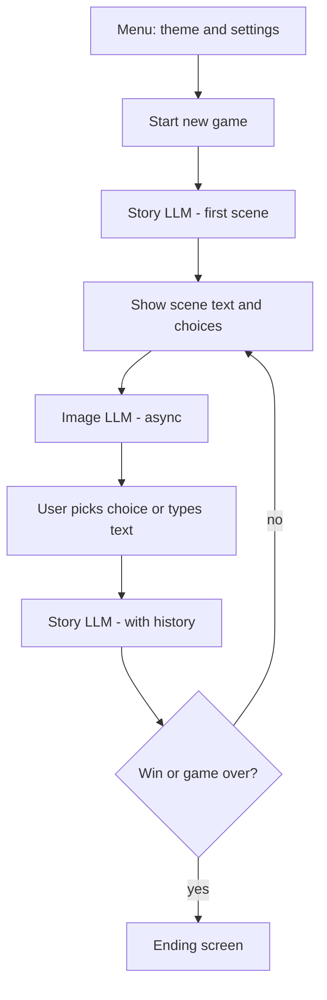
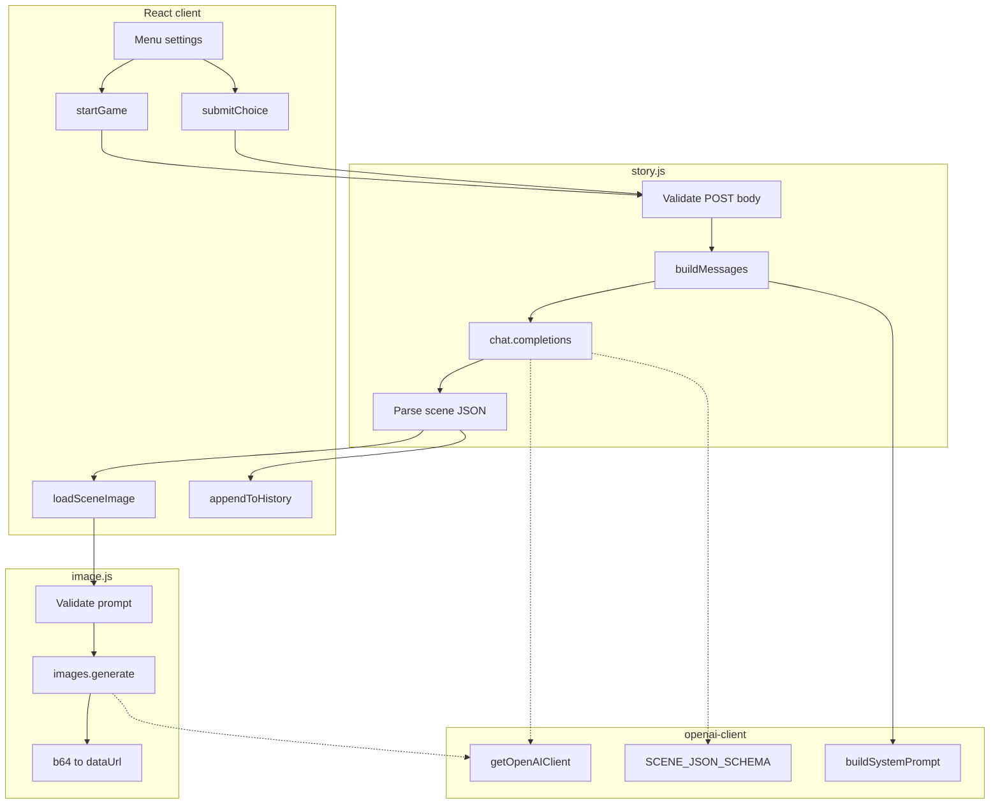
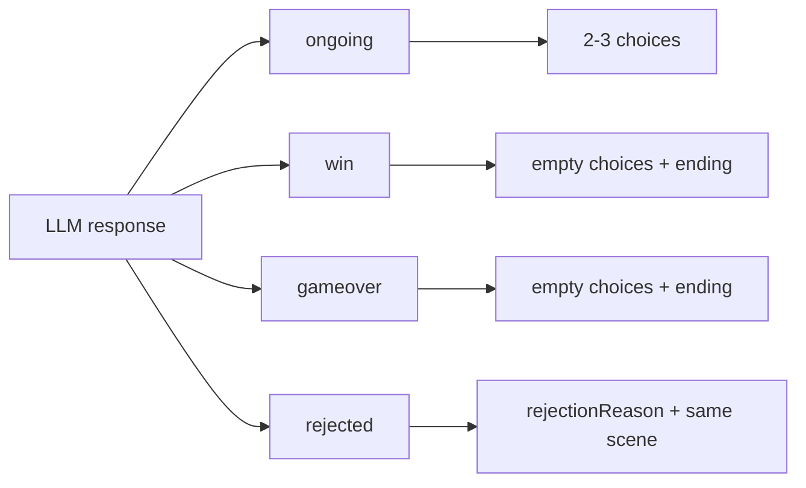

# LLM workflow

Zjednodušený algoritmus LLM volaní. Architektúra, API kontrakt a obrazovky: [overview.md](./overview.md).

## Hra + LLM pipeline



Text scény sa zobrazí hneď; obrázok sa doťahuje asynchrónne (`loadSceneImage`). Pri `rejected` sa krok neposúva — hráč skúša znova na tej istej scéne.

## Top-level tok



Story a image bežia **nezávisle** — klient najprv zobrazí text scény, obrázok doťahuje asynchrónne.

## Story (`story.js`)

```
POST /api/story
  │
  ├─ method ≠ POST → 405
  ├─ invalid JSON → 400
  ├─ chýba action | stepsPlanned | theme | textLength → 400
  │
  ├─ stepNumber = action === 'start' ? 1 : (počet assistant záznamov v history + 1)
  │
  ├─ messages =
  │     [ system: buildSystemPrompt(stepsPlanned, stepNumber, theme, textLength) ]
  │     + history (role/content páry z klienta)
  │     + user:
  │         start  → "Začni novú hru v téme: {theme}…"
  │         choice → payload (voľba hráča alebo vlastný text)
  │
  ├─ OpenAI chat.completions.create
  │     model: gpt-5.4-nano
  │     response_format: json_schema (SCENE_JSON_SCHEMA, strict)
  │
  └─ parse content → { scene } | chyba → 502/500
```

### Výstup scény — vetvenie podľa `status`



## Image (`image.js`)

```
POST /api/image
  │
  ├─ method ≠ POST → 405
  ├─ chýba prompt → 400
  │
  ├─ OpenAI images.generate
  │     model: gpt-image-1
  │     size: 1024×1024, quality: low, n: 1
  │
  └─ b64_json → data:image/png;base64,... | chyba → 502/500
```

Prompt pochádza z poľa `scene.imagePrompt` (generuje story LLM v rovnakej odpovedi).

## System prompt (`buildSystemPrompt`)

Kľúčové vstupy do system správy:

| Vstup | Účel |
|-------|------|
| `theme` | Konzistentná téma príbehu a vizuálneho štýlu |
| `textLength` | concise / standard / detailed — dĺžka narratívu a volieb |
| `stepNumber`, `stepsPlanned` | Interná dĺžka hry; LLM môže upraviť `stepsPlanned` ±2–3 |
| blízkosť konca | Pri `stepNumber >= stepsPlanned - 2` → smerovať k záveru |

Pravidlá v prompte: slovenčina, Markdown subset, JSON schema, správanie pre každý `status`.

## História konverzácie

Klient skladá `history` pre ďalšie kroky:

1. **user** — text voľby alebo vlastný vstup
2. **assistant** — `sceneTitle` + `sceneNarrative` + zoznam volieb (ak existujú)

Pri `rejected` klient krok neposúva — história sa neaktualizuje o novú scénu.

## Modely a zdieľané konštanty

| Konštanta | Hodnota | Použitie |
|-----------|---------|----------|
| `STORY_MODEL` | `gpt-5.4-nano` | Text + štruktúrovaná scéna |
| `IMAGE_MODEL` | `gpt-image-1` | Ilustrácia scény |
| `SCENE_JSON_SCHEMA` | strict JSON schema | Validácia výstupu story LLM |

Všetko v `netlify/functions/_openai-client.js`. API kľúč len server-side (`OPENAI_API_KEY`).
